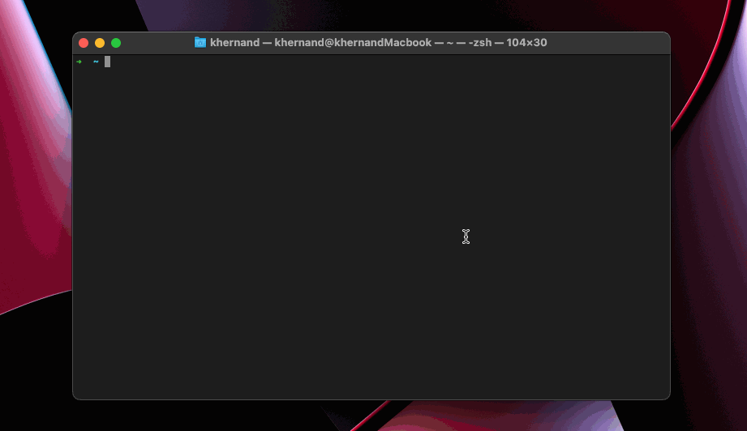

You are in your terminal, remoting into a server in your stage
environment. Time to run that script to drop a bunch of database tables
(isn't Friday at 4:59 PM the best?)!

*Sinking Feeling...* That was Stage, right? All these terminal tabs look
the same!

Whether you're running commands on remote machines and want some piece
of mind or just want a little more swag, adding some color to your SSH
sure is nice.

**Here's how I got it done on my Mac's default terminal, Terminal.app.**

## Set Up

### Terminal Settings

The terminal has a selection of themes available in the terminal
preferences.


These themes can be really detailed and are what we are going to switch
dynamically when connecting to different SSH connections. We can use any
of the default themes here or create our own.

While we are here, We want to tweak the setting to ensure
`New tabs open with: Default Profile`.


### AppleScript 

Now, let's create an AppleScript, 
`$HOME/Documents/scripts/changeTerminalTheme.scpt`, 
that updates the current Terminal tab's theme. 

```javascript
on run argv
    tell application "Terminal"
        set current settings of selected tab of front window to settings set (item 1 of argv)
    end tell
end run
```

This small script takes the name of any theme we have defined in our 
Terminal preferences, and sets only the active tab to that theme.

See our script in action:


Progress!

### SSH Alias

Add this alias to your `~/.bash_aliases` and make sure it is sourced
in your `~/.zshrc` (or `~/.bashrc`) with `source $HOME/.bash_aliases`.
This defines the theme we will switch back to when an SSH connection
closes.

```shell
function ssh_alias() {
  ssh "$@";
  osascript ~/Documents/scripts/changeTerminalTheme.scpt Basic
}

alias ssh=ssh_alias
```

In the example above, I define `Basic` as the theme I want my terminal
to be by default.

### SSH Config

1. Edit `/etc/ssh/ssh_config` and ensure `PermitLocalCommand yes`
is under your `Host *` config.
2. Edit `~/.ssh/config` and define the themes for any given host:
```shell
Host your.production.host
   User root
   LocalCommand osascript ~/Documents/scripts/changeTerminalTheme.scpt "Solid Colors"
```
Replace `Solid Colors` here with any theme defined in your terminal 
preferences.

### We're Done!

In this demo, the first terminal tab is to a server I defined to use
the `Ocean` theme, the second tab is starting an SSH connection to a 
server I defined using the `Other` theme. And the third tab has no 
connection, so it uses my default, `Basic` theme.




